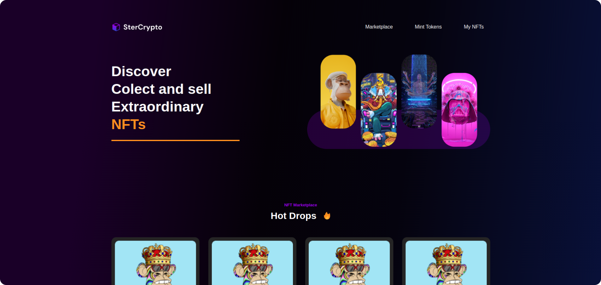

<div id="top"></div>

<div align="center">
   <a href="#">
       
  </a>
    <a href="#">
          
   </a>  
   <a href="#">
       
   </a>  
   <a href="https://www.linkedin.com/in/marcos-antonio-579370160/" target="_blank">
      
    </a>
</div>
 

<!-- ABOUT THE PROJECT -->

## About The Project

<a href="" target="_blank">
  
</a> 
<br> 
<br> 
   SterCrypto is a template for a responsive NFTs marketplace, create your market and build a great experience for your users.  It's built with NextJs and Chakra
<br> 

<p align="right">(<a href="#top">back to top</a>)</p>
 
 
<!-- GETTING STARTED -->

## Getting Started

### Installation and Running Locally
 
1. Clone the repo
   ```bash
   
   git clone https://github.com/Marcos-An/ster-crypto.git
   
   ```
2. Install node modules with yarn/npm packages
   ```bash
   
   yarn || npm install 
   
   ```
   
3. Run with yarn/npm packages
   ```bash
   
   yarn dev || npm run dev 
   
   ```  
 
<p align="right">(<a href="#top">back to top</a>)</p>
 
 
## Built with

-   [NextJs](https://nextjs.org/) 
-   [Chakra](https://chakra-ui.com/)
-   [TypeScript](https://www.typescriptlang.org/) 

<!-- CONTACT -->

## Contact
<a href="https://www.linkedin.com/in/marcos-antonio-579370160/" target="_blank">
  
  <p>Marcos Silva</p>
</a>
<br /> 
<div >
     <a href="https://www.linkedin.com/in/marcos-antonio-579370160/" target="_blank">
      
    </a>
   <a href="mailto:marcos.silva.0556@gmail.com" target="_blank">
      
    </a>

</div> 

<!-- CONTACT -->

## License

Distributed under the MIT License. See <a href="https://github.com/Marcos-An/noemia/blob/main/LICENSE" target="_blank"> MIT </a> for more information.

<p align="right">(<a href="#top">back to top</a>)</p>


